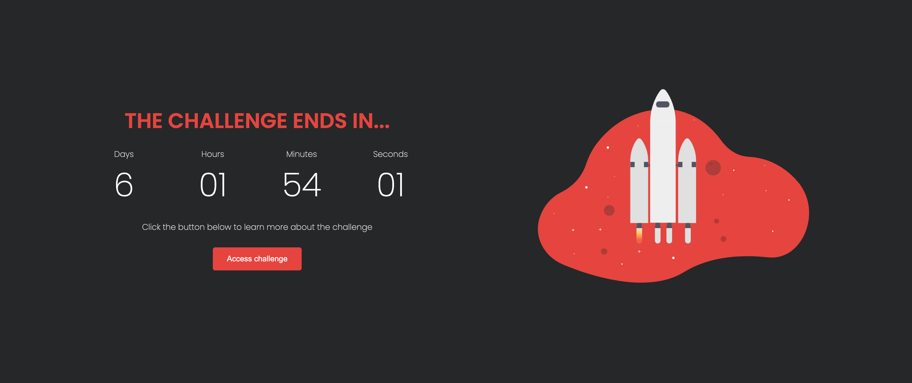

# Coming soon page

> 1º desafio da mentoria Conquiste Sua Vaga

O projeto acima foi criado como primeiro desafio da mentoria ***conquiste sua vaga***, com a finalidade de fixar conhecimentos da stack front-end e com o objetivo de conseguir minha primeira vaga na área.

[🔗 Clique aqui para acessar](https://matheusvaz-dev.github.io/nlw-esports-explorer/)

## 🛠️ Tecnologias

- HTML;
- CSS;
- Javascript;
- Git e Github.

## 📧 Contato

matheusvaz.ux@gmail.com
